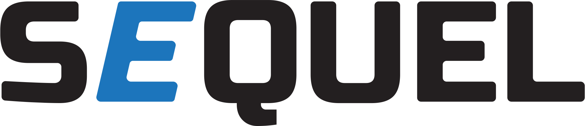

# SEQUEL Softwear

[comment]: 

## 1. Description
The SEQUEL software is designed to solve problems in the field of molecular biology and related fields. Its main advantages are cross-platform, open source code and a new approach that allows you to design your own analysis pipelines. The software also integrates the Linux kernel, which allows you to run complex and specific tools.

 

## Currently under development.
